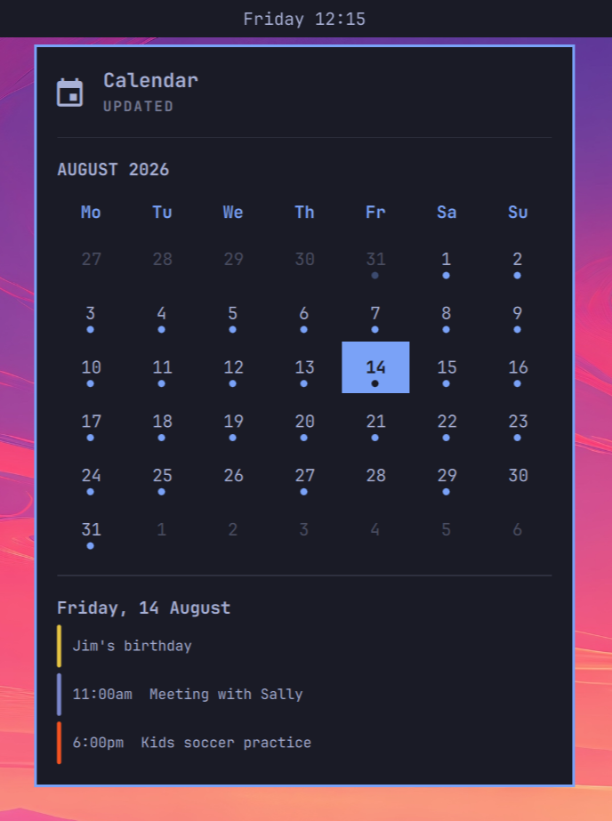

# Intemporel — Omarchy Quattro Clock/Calendar Plugin

Intemporel is a clock replacement and read-only calendar for
[Omarchy](https://omarchy.org/). It displays a date/time label in the bar and
opens an event calendar from public iCalendar (ICS) feeds.



## Features

- Drop-in replacement for `omarchy.clock`: left-click opens the calendar,
  right-click cycles clock formats, and middle-click opens the timezone picker.
- Monthly calendar view with today and the selected day highlighted
- Read-only event display from one or more public ICS URLs
- Calendar-specific names and colors
- Keyboard navigation
- No calendar accounts, credentials, or write access required

## Installation

Install the plugin with the Omarchy plugin manager:

```bash
omarchy plugin add https://github.com/pomartel/intemporel.git
```

The plugin is installed at:

```text
~/.config/omarchy/plugins/intemporel/
```

Replace the default clock in `~/.config/omarchy/shell.json`. Intemporel uses
the system locale by default for dates, times, and its interface; English,
French, and Spanish interface translations are included. Set `locale` on the
bar entry to override it.

```json
{
  "bar": {
    "centerAnchor": "intemporel",
    "layout": {
      "center": [{
        "id": "intemporel",
        "format": "dddd HH:mm",
        "formatAlt": "d MMMM 'W'ww yyyy",
        "locale": "fr_CA"
      }]
    }
  }
}
```

The calendar can also be opened through the Omarchy shell IPC interface:

```bash
omarchy-shell shell toggle intemporel
```

## Configuration

Edit `calendars.jsonc` in the plugin directory to configure your calendars:

```text
~/.config/omarchy/plugins/intemporel/calendars.jsonc
```

```json
{
  "calendars": [
    {
      "name": "Work",
      "url": "https://example.com/work.ics",
      "color": "#4285F4"
    },
    {
      "name": "Family",
      "url": "https://example.com/family.ics",
      "color": "#F59E0B"
    }
  ]
}
```

Each calendar entry supports:

- `name`: label used internally for the calendar source
- `url`: public, read-only ICS feed URL
- `color`: optional color for the event marker
- `excludeDeclined`: optional; defaults to `true`, hiding invitations you
  declined. Set it to `false` to show them.

### Feed cache

Intemporel keeps the last successful response for each feed in
`~/.cache/intemporel-calendar-cache.json`. Cached events appear immediately
when the calendar opens; feeds then refresh in the background. The cache is
local and may contain the same private calendar data as the configured ICS URLs.

### Privacy and security

Only use feeds that are intended to be shared with the people who can access
your computer. Some calendar providers use hard-to-guess URLs as a form of
access control. Treat those URLs like passwords and do not commit them to a
public repository.

Intemporel only downloads and displays events. It does not create, edit, or
delete calendar data.

## Keyboard controls

| Key | Action |
| --- | --- |
| `↑` `↓` `←` `→` | Move the selected day |
| `Ctrl` + arrow keys | Change month |
| `Enter` or `Home` | Go to today |
| `r` | Refresh calendar feeds |
| `?` | Toggle keyboard help |
| `Esc` | Close the panel |

## Troubleshooting

### No calendars appear

Check that:

1. `calendars.jsonc` is valid JSONC.
2. Each feed URL is reachable without authentication.
3. `curl -fsSL "https://example.com/calendar.ics"` can fetch the feed.
4. The feed contains valid `VEVENT` entries.

## Updating

Update installed plugins with:

```bash
omarchy plugin update intemporel
```

## Removal

Before removing the plugin, replace the `intemporel` center entry in
`~/.config/omarchy/shell.json` with Omarchy's default clock (keep any other
widgets in `center`):

```json
{
  "bar": {
    "centerAnchor": "omarchy.clock",
    "layout": {
      "center": [{
        "id": "omarchy.clock",
        "format": "dddd HH:mm",
        "formatAlt": "d MMMM 'W'ww yyyy",
        "verticalFormat": "HH\n—\nmm"
      }]
    }
  }
}
```

Then remove Intemporel:

```bash
omarchy plugin remove intemporel
```

The command disables and unloads the plugin, including its in-plugin calendar
configuration. It preserves the feed cache. To discard cached events too, run:

```bash
rm -f "~/.cache/intemporel-calendar-cache.json"
```

## Development

The plugin consists of:

- `BarWidget.qml`: clock label and calendar host, following the Omarchy clock structure
- `Model.js`: clock label formatting helpers
- `Calendar.qml`: calendar UI, keyboard handling, and shell integration
- `CalendarModel.js`: ICS parsing, recurrence expansion, and formatting
- `calendars.jsonc`: starter calendar configuration
- `manifest.json`: Omarchy plugin metadata and entry point

Validate the plugin before submitting changes:

```bash
omarchy plugin validate .
qmllint -I /usr/share/omarchy/shell Calendar.qml
node --check CalendarModel.js
```

Pull requests and issue reports are welcome.

## License

Intemporel is released under the [MIT License](LICENSE).
