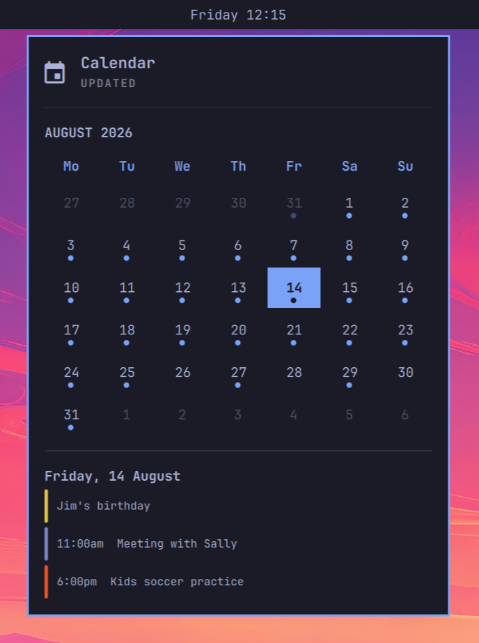

# Intemporel — Omarchy Quattro Clock/Calendar Plugin

Intemporel is a clock replacement and read-only calendar for
[Omarchy](https://omarchy.org/). It displays a date/time label in the bar and
opens an event calendar from public iCalendar (ICS) feeds.



## Features

- Drop-in replacement for `omarchy.clock`: left-click opens the calendar,
  right-click cycles clock formats, and middle-click opens the timezone picker.
- Monthly calendar view with today and the selected day highlighted
- Read-only event display from one or more public ICS URLs
- Calendar-specific names and colors
- Keyboard navigation
- No calendar accounts, credentials, or write access required

## Installation

Requires Quickshell/Omarchy, `curl`, Python 3.11 or newer, and `uv` on PATH.
On Omarchy, install missing runtime dependencies with `omarchy pkg add uv python curl`.
The calendar service uses `uv` to install the exact Python dependencies in
`backend.py.lock` into its own cache on first launch. That first launch needs
internet access; subsequent launches can reuse the installed dependencies offline.
No system Python packages are modified.

Install the plugin with the Omarchy plugin manager:

```bash
omarchy plugin add https://github.com/pomartel/intemporel.git
```

The plugin is installed at:

```text
~/.config/omarchy/plugins/intemporel/
```

Replace the default clock in `~/.config/omarchy/shell.json`. Intemporel uses
the system locale by default for dates, times, and its interface; English,
French, and Spanish interface translations are included. Set `locale` on the
bar entry to override it.

```json
{
  "bar": {
    "centerAnchor": "intemporel",
    "layout": {
      "center": [{
        "id": "intemporel",
        "format": "dddd HH:mm",
        "formatAlt": "d MMMM 'W'ww yyyy",
        "locale": "fr_CA"
      }]
    }
  }
}
```

The calendar can also be opened through the Omarchy shell IPC interface:

```bash
omarchy-shell shell toggle intemporel
```

## Configuration

If `~/.config/intemporel/calendars.jsonc` exists, it takes precedence. Otherwise,
copy `calendars.jsonc.example` to `calendars.jsonc` in the plugin directory and
edit that file:

```text
~/.config/omarchy/plugins/intemporel/calendars.jsonc
```

```json
{
  "calendars": [
    {
      "name": "Work",
      "url": "https://example.com/work.ics",
      "color": "#4285F4",
      "emails": ["you@example.com"]
    },
    {
      "name": "Family",
      "url": "https://example.com/family.ics",
      "color": "#F59E0B"
    }
  ]
}
```

Each calendar entry supports:

- `name`: label used internally for the calendar source
- `url`: public, read-only ICS feed URL
- `color`: optional color for the event marker
- `emails`: optional list of your attendee email addresses for this feed.
  A single `email` string is also accepted. Matching ignores case and `mailto:`.
- `excludeDeclined`: defaults to `true`; hides occurrences declined by one of
  your configured `emails`. Other attendees' declines do not hide your meetings.
  Without an email identity, invitations remain visible. Set it to `false` to
  show your declined invitations too.

Each URL must be unique and use HTTP, HTTPS or a local `file://` URL
(`webcal:` is converted to HTTPS). Local feeds retain the same size and validation limits.
Different feeds retain their own events even when their event UIDs match.

### Calendar support

The background service uses `icalendar` and `recurring-ical-events` for timezone
and recurrence handling, including named/embedded timezones, daylight saving
transitions, `BYDAY`/`BYMONTHDAY`/`BYSETPOS`, `RDATE`, `EXDATE`, moved occurrences,
and cancellations. Floating times use the computer's local timezone; date-only
events remain all-day events. Event alarms cannot overwrite event fields.

Only the visible six-week grid is expanded. Parsed feeds and recent windows are
cached in one service shared by all monitors, and selecting another day in the
same window does not expand recurrences again. Long day lists can be scrolled.

### Feed cache

Intemporel keeps the last successful response for each feed in
`~/.cache/intemporel-calendar-cache.json`. Cached events appear immediately
when the calendar opens; feeds then refresh in the background. The cache is
local and may contain the same private calendar data as the configured ICS URLs.
It is written atomically with owner-only permissions. The previous cache format
is read automatically. Invalid/non-calendar responses and failed downloads keep
the last valid feed. Editing configuration during a download invalidates its
response, so old data cannot be attributed to a new calendar.

Downloads have a 15-second timeout and a 16 MiB per-feed limit. Calendar
processing is limited to five seconds per feed/query and 10,000 occurrences per
window; an oversized or pathological feed reports a refresh failure instead of
blocking the shell.

### Privacy and security

Only use feeds that are intended to be shared with the people who can access
your computer. Some calendar providers use hard-to-guess URLs as a form of
access control. Treat those URLs like passwords and do not commit them to a
public repository.

Intemporel only downloads and displays events. It does not create, edit, or
delete calendar data.

## Keyboard controls

| Key | Action |
| --- | --- |
| `↑` `↓` `←` `→` | Move the selected day |
| `Ctrl` + arrow keys | Change month |
| `Enter` or `Home` | Go to today |
| `r` | Refresh calendar feeds |
| `?` | Toggle keyboard help |
| `Esc` | Close the panel |

## Troubleshooting

### No calendars appear

Check that:

1. `calendars.jsonc` is valid JSONC.
2. Each feed URL is reachable without authentication.
3. `curl -fsSL "https://example.com/calendar.ics"` can fetch the feed.
4. The feed contains valid `VEVENT` entries.

## Updating

Update installed plugins with:

```bash
omarchy plugin update intemporel
```

## Removal

Before removing the plugin, replace the `intemporel` center entry in
`~/.config/omarchy/shell.json` with Omarchy's default clock (keep any other
widgets in `center`):

```json
{
  "bar": {
    "centerAnchor": "omarchy.clock",
    "layout": {
      "center": [{
        "id": "omarchy.clock",
        "format": "dddd HH:mm",
        "formatAlt": "d MMMM 'W'ww yyyy",
        "verticalFormat": "HH\n—\nmm"
      }]
    }
  }
}
```

Then remove Intemporel:

```bash
omarchy plugin remove intemporel
```

The command disables and unloads the plugin, including its in-plugin calendar
configuration. It preserves the feed cache. To discard cached events too, run:

```bash
rm -f "$HOME/.cache/intemporel-calendar-cache.json"
```

## Development

The plugin consists of:

- `BarWidget.qml`: clock label and calendar host, following the Omarchy clock structure
- `Model.js`: clock label formatting helpers
- `Calendar.qml`: calendar UI, keyboard handling, and shell integration
- `CalendarModel.js`: small configuration and display helpers
- `service/CalendarStore.qml`: shared config watcher, request generations, and worker IPC
- `backend.py`: background downloads, validated ICS parsing, recurrence expansion, and cache
- `backend.py.lock`: reproducible Python dependency versions
- `tests/`: recurrence, filtering, cache/race, and real Quickshell IPC regression tests
- `calendars.jsonc.example`: starter calendar configuration
- `manifest.json`: Omarchy plugin metadata and entry point

Validate the plugin before submitting changes:

```bash
omarchy plugin validate .
qmllint -I /usr/share/omarchy/shell Calendar.qml service/CalendarStore.qml
node tests/model.test.cjs
PYTHONDONTWRITEBYTECODE=1 uv run --locked --script backend.py --test
```

Run tests from a development checkout outside the installed plugins directory,
so temporary test entry points do not trigger shell hot reloads. The integration
test uses a temporary home/cache and a local HTTP fixture; it does not access
your calendars. It is skipped if Quickshell or uv is unavailable.

To update dependencies deliberately, run `uv lock --script backend.py --upgrade`
and rerun the regression tests before committing the lockfile.

Pull requests and issue reports are welcome.

## License

Intemporel is released under the [MIT License](LICENSE).
